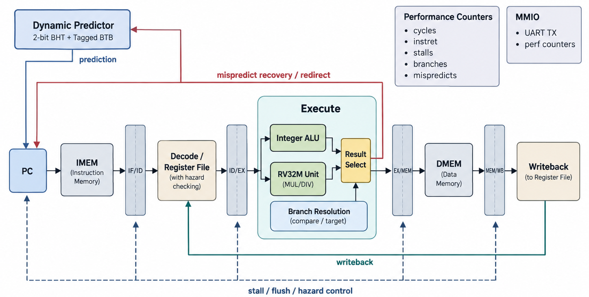
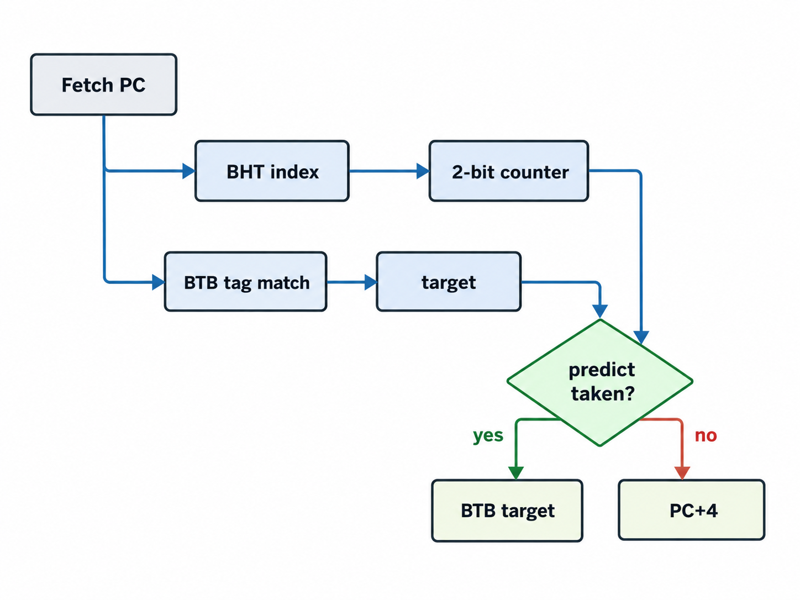
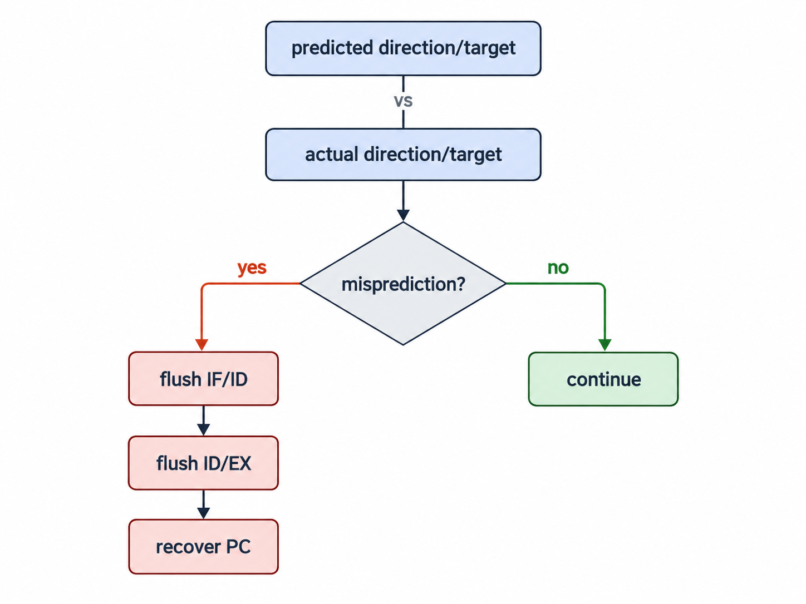
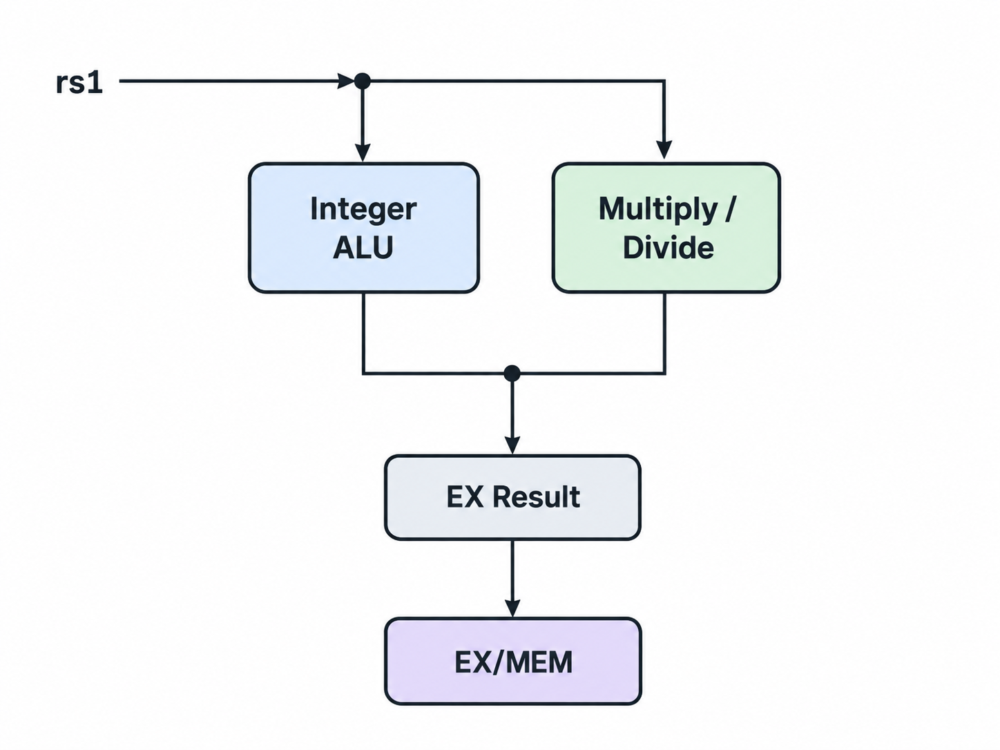

# RV32Forge

<p align="center">
  <b>A Speculative 5-Stage RV32IM Processor in SystemVerilog</b><br>
  Dynamic Branch Prediction · Forwarding · Hazards · RV32M · Performance Counters · MMIO
</p>

<p align="center">
  
</p>

## Overview

**RV32Forge** upgrades the original RV32Forge into a more serious processor-microarchitecture project. It keeps the readable five-stage in-order pipeline while adding speculation, the RISC-V multiply/divide extension, measurable performance behavior, and a small SoC memory map.

## Highlights

- 5-stage `IF / ID / EX / MEM / WB` pipeline
- **RV32I + RV32M** integer execution
- 32 × 32-bit register file (`x0 = 0`)
- EX/MEM -> EX forwarding
- MEM/WB -> EX forwarding
- WB -> ID bypass
- automatic load-use bubble insertion
- **256-entry dynamic branch predictor**
- 2-bit saturating prediction counters
- tagged Branch Target Buffer (BTB)
- speculative next-PC selection
- EX-stage misprediction recovery
- JAL/JALR prediction after BTB training
- byte / halfword / word loads and stores
- signed and unsigned comparisons
- memory-mapped UART output
- memory-mapped performance counters
- cycle / retirement / stall / branch / misprediction statistics
- tiny Python assembler
- multiple self-checking testbenches
- C golden models
- VCD waveform support
- no vendor IP

## Supported ISA

### RV32I arithmetic / logic

`ADD SUB SLL SLT SLTU XOR SRL SRA OR AND`

### Immediate

`ADDI SLTI SLTIU XORI ORI ANDI SLLI SRLI SRAI`

### Memory

`LB LH LW LBU LHU SB SH SW`

### Control

`BEQ BNE BLT BGE BLTU BGEU JAL JALR`

### Upper immediate

`LUI AUIPC`

### RV32M

`MUL MULH MULHSU MULHU DIV DIVU REM REMU`

`ECALL` remains a simulation halt marker; privileged trap/CSR execution is not claimed.

## Dynamic Branch Predictor

The front end uses a small dynamic predictor:

<p align="center">
  
</p>

Prediction metadata is carried down the pipeline. In EX:

<p align="center">
  
</p>


This turns branch handling into a measurable microarchitectural experiment rather than always paying the same taken-branch penalty.

## RV32M Datapath

The execute stage now selects between the integer ALU and the M-extension unit:

<p align="center">
  
</p>

The current divider is combinational. That makes the implementation easy to study, while deliberately exposing a realistic timing trade-off for future iterative/pipelined optimization.

## Performance Counters

RV32Forge directly exposes:

```text
cycle_count
instret_count
stall_count
branch_count
mispredict_count
```

Useful derived metrics include:

```text
CPI = cycles / retired instructions

Predictor accuracy =
1 - mispredictions / resolved control transfers
```

## Memory Map

| Address | Device |
|---|---|
| `0x0000_0000 ...` | data RAM |
| `0x1000_0000` | UART TX |
| `0x1000_0010` | cycle counter |
| `0x1000_0014` | retired instructions |
| `0x1000_0018` | load-use stalls |
| `0x1000_001C` | branches / jumps resolved |
| `0x1000_0020` | branch mispredictions |

A byte/word store to the UART address prints its low byte in simulation.

## Repository Structure

```text
RV32Forge/
├── rtl/
│   ├── rv32_core.sv
│   ├── rv32_soc.sv
│   ├── branch_predictor.sv
│   ├── muldiv_unit.sv
│   ├── alu.sv
│   ├── regfile.sv
│   └── imm_gen.sv
│
├── tb/
│   ├── tb_rv32_soc.sv
│   ├── tb_rv32m.sv
│   └── tb_branch_predictor.sv
│
├── programs/
│   ├── demo.s / demo.hex
│   ├── rv32m_demo.s / rv32m_demo.hex
│   └── branch_bench.s / branch_bench.hex
│
├── tools/
│   └── mini_rv32_asm.py
│
├── sw/
│   ├── golden.c
│   └── golden_rv32m.c
│
├── docs/
│   ├── architecture.md
│   └── verification.md
│
├── cpu.png
├── Makefile
├── LICENSE
└── README.md
```

## Quick Start

Ubuntu/Debian:

```bash
sudo apt update
sudo apt install python3 gcc make iverilog gtkwave
```

Build all assembly images:

```bash
make asm
```

Run the C reference test:

```bash
make test-c
```

Run RTL tests:

```bash
make sim
make sim-m
make sim-branch
```

or all three:

```bash
make sim-all
```

Open the main waveform:

```bash
gtkwave rv32forge.vcd
```

## Included Experiments

### 1. Pipeline / hazard test

Expected signature:

| Address | Value |
|---|---:|
| `0x100` | 55 |
| `0x104` | 110 |
| `0x108` | 1 |
| `0x10C` | 165 |

### 2. RV32M test

Exercises multiply, signed multiply, division, and remainder, including negative operands.

### 3. Predictor benchmark

A 40-iteration loop computes:

```text
1 + 2 + ... + 40 = 820
```

The loop branch is repeatedly taken and gives the two-bit predictor a simple workload to learn. The self-checking test verifies both functional output and that mispredictions stay below the number of resolved branches.

## Why this is a stronger CPU project

The original version demonstrated pipelining. RV32Forge additionally demonstrates **microarchitecture policy**:

- when to speculate,
- how to recover from wrong-path execution,
- how to measure predictor quality,
- how arithmetic extensions affect the EX path,
- how software can observe hardware performance,
- how a core connects to MMIO rather than only raw testbench RAM.

That makes the repository useful for computer-architecture, FPGA, ASIC, and RISC-V portfolio work.

## Strong Next Extensions

- iterative/pipelined DIV/REM unit with EX back-pressure
- machine-mode CSR file (`mstatus`, `mtvec`, `mepc`, `mcause`)
- exceptions and timer/external interrupts
- instruction and data caches
- AXI4-Lite or Wishbone interconnect
- static vs dynamic predictor comparison
- return-address stack
- gshare predictor
- RVFI-style formal trace interface
- SymbiYosys assertions
- FPGA UART bootloader
- Yosys/OpenROAD PPA study

## License

MIT

---

## Author

### Matin Firoozbakht

<p align="center">
  <a href="https://github.com/matinfirooz">
    github.com/matinfirooz
  </a>
</p>


<p align="center">
  <b>RV32Forge — from a five-stage pipeline to a measurable speculative processor.</b>
</p>
